# 프로젝트 주간 페어 프로그래밍 - 음악 리뷰 커뮤니티 개발 프로젝트 + 배포

## 참여자

- 윤혜진 [깃허브](https://github.com/hyejinny97)
- 김병우 [깃허브](https://github.com/BuildEnough)
- 김윤지 [깃허브](https://github.com/YoonDii)

## 과정

- [목표](#목표)
- [준비 사항](#준비-사항)
- [요구사항](#요구-사항)
- [프로젝트 결과 완성본](#프로젝트-결과-완성본)


## 목표

페어 프로그래밍을 통한 영화 리뷰 커뮤니티 서비스를 개발

- **CRUD** 구현(구현 방법 제한 없음)
- **Staticfiles** 활용 정적 파일(이미지, CSS, JS) 다루기
- Django **Auth** 활용 회원 관리(회원 가입 / 회원 조회 / 로그인 / 로그아웃)
- Media 활용 동적 파일 다루기
- 모델간 **1 : N / M : N 관계** 매핑

## 준비 사항
### ▶ 개발 중 - GitHub 병합 충돌 처리 가이드
> 병합 충돌이 발생하는 원인

- 병합 충돌은 동일한 파일의 동일한 줄의 코드를 다르게 작성했을 때 발생합니다.
- 단, 코드를 똑같이 작성했을 때에는 충돌이 발생하지 않음

> 충돌 상황

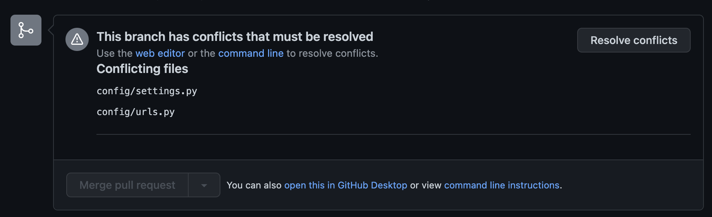

1. A 개발자가 articles 앱을 만들고, `settings.py/urls.py`을 수정한 후 master 브랜치에 병합
2. B 개발자가 accounts 앱을 만들고, `settings.py/urls.py`을 수정한 후 master 브랜치로 PR 생성
3. A, B 개발자가 동시에 수정한 `settings.py/urls.py`에서 병합 충돌(merge conflict) 발생

> 충돌 해결 과정

1. 충돌 해결을 위해 Resolve conflicts 버튼 클릭

   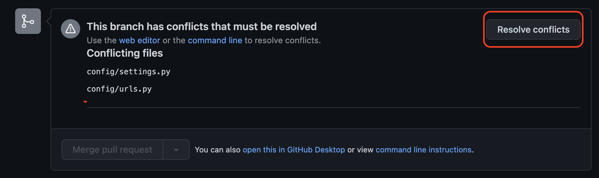

2. 각 파일에서 충돌(conflict)가 발생한 코드 뭉치 해결

   - 충돌이 난 부분에서 필요한 코드만 남기고, 수정 삭제합니다.

   - `settings.py`

     - 수정 전: `‘account’,` 와 `‘articles’,` 가 충돌난 상태

         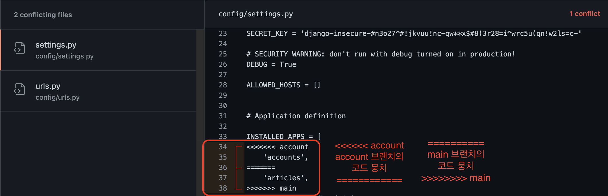

     - 수정 후: 두 줄 모두 필요해서 구분선(`<<<<<<` , `======` , `>>>>>`)만 삭제

         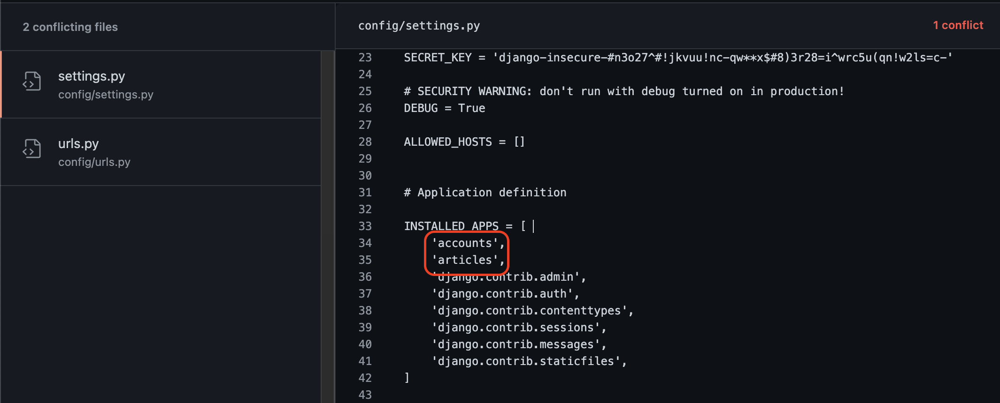

   - `urls.py`

      - 수정 전: 두 path가 충돌난 상태

          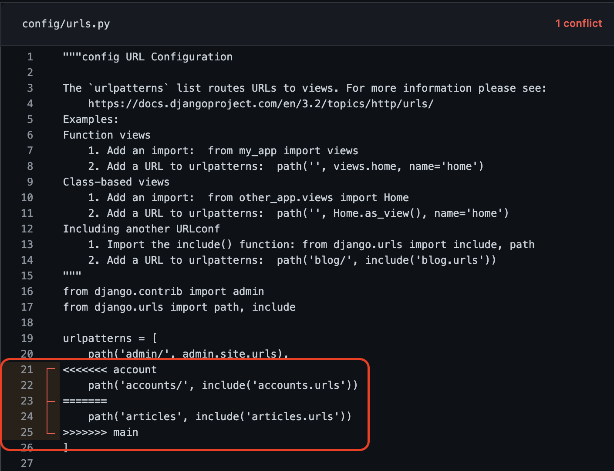

      - 수정 후: 두 path 보존 / 각 path 마지막에 쉼표(`,`) 추가 /  구분선 삭제

          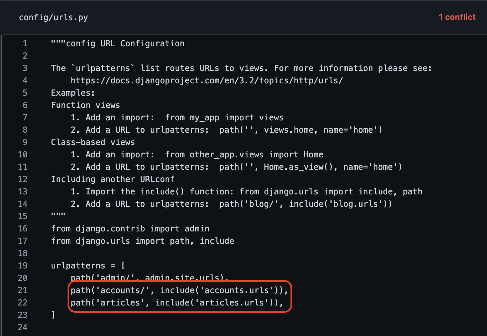

3. 모든 파일 충돌 해결 완료 확인 후 `Mark as resolved` 클릭

   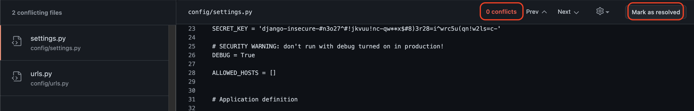

4. 파일 확인 후 `Commit Merge` 클릭

   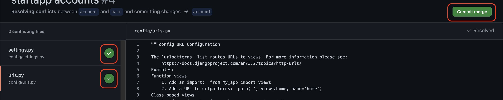

5. 병합 진행

   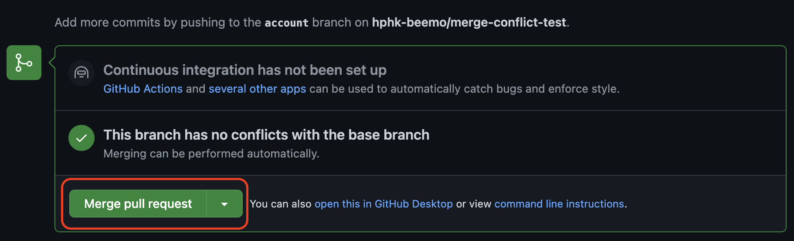

### ▶ 개발 완료 후 - 헤로쿠(Heroku) 배포 가이드

- [Heroku Working with Django](https://devcenter.heroku.com/categories/working-with-django)

   

> Git

- 헤로쿠는 기본적으로 git을 활용해서 배포를 합니다.

> Heroku 설치 & 로그인

1. Heroku CLI 설치
   
   - 아래 사이트에서 OS에 맞게 설치
   - [Install the Heroku CLI](https://devcenter.heroku.com/articles/heroku-cli)

2. [터미널] Heroku 설치 확인

   ```bash
   heroku --version

   # 아래 메세지가 출력되면 정상
   # heroku/7.65.0 darwin-x64 node-v14.19.0
   ```

> 배포 준비

1. [터미널] 패키지 설치

   - 가상 환경이 실행된 상태인지 확인합니다.
  
   ```bash
   pip install gunicorn 
   pip install dj-database-url # PostgreSQL 설정용 패키지
   pip install psycopg2-binary # PostgreSQL 설정용 패키지
   pip install whitenoise # 정적 파일 처리용 패키지
   pip install python-dotenv # 환경 변수 관리 패키지

   pip freeze > requirements.txt # 패키지 목록 저장
   ```

2. [Procfile] Procfile

   - Procfile
     - 헤로쿠가 배포 과정에 실행할 명령어 모음 파일
   
   - `manage.py`가 있는 폴더에 Procfile(대소문자 구분) 생성하고 아래 명령어 작성

      ```bash
      web: gunicorn [프로젝트명].wsgi --log-file -
      ```

3. [runtime.txt] runtime.txt 생성

   - runtime.txt
     - 헤로쿠가 사용해야할 파이썬 버전 명시
   
   - manage.py 가 있는 폴더에 `runtime.txt` 생성 후 버전 작성

      ```plain
      python-3.9.15
      ```

4. [settings.py] 데이터베이스 PostgreSQL 설정

   - PostgreSQL
      - 관계형 데이터베이스 중 하나로 헤로쿠에서 기본적으로 지원하는 데이터베이스
      - 헤로쿠에서는 SQLite를 사용할 수 없기 때문에 추가 설정이 필요합니다.
    - [settings.py] DATABASES 아래에 코드를 추가합니다.

      ```python
      DATABASES = {
         "default": {
            "ENGINE": "django.db.backends.sqlite3",
            "NAME": BASE_DIR / "db.sqlite3",
         }
      }

      """
      기존 DATABASES 코드 아래에 아래 세 줄을 추가합니다.
      """
      import dj_database_url

      db_from_env = dj_database_url.config(conn_max_age=500)
      DATABASES["default"].update(db_from_env)
      ```

5. [.env / settings.py] SECRET_KEY 분리

   - SECRET_KEY
      - Django 인증(회원가입, 로그인 등등) 과정에 필요한 외부로 노출되면 안되는 비밀키입니다.
    - [Djecrety.ir](https://djecrety.ir/) 에서 새로운 SECRET_KEY를 생성해서 사용합니다.
    
    - manage.py가 있는 폴더에`.env` 파일을 생성합니다.
    
    - [.env] 생성한 SECRET_KEY를 작성합니다.

      ```plain
      # .env
      SECRET_KEY="생성한 SECRET_KEY"

      # 예시
      # SECRET_KEY="$o5(+um4@+4g#3pp_zj-+b3vx99qbecllpsr%wh-d&hk(d=he@"
      ```

   - `.env` 파일을 `.gitignore`에 추가합니다.
   - [settings.py] SECRET_KEY 코드를 수정합니다.

      ```python
      """
      기존
      SECRET_KEY = "..."
      """

      # 수정
      """
      아래 3줄은 파일 최상단에 작성합니다.
      """
      from dotenv import load_dotenv
      import os
      load_dotenv() # .env 파일에서 환경 변수를 불러옵니다.

      # 기존 SECRET_KEY 대신 사용합니다.
      SECRET_KEY = os.getenv("SECRET_KEY")
      ```

6. [settings.py] ALLOWED_HOSTS 설정

   - ALLOWED_HOSTS
      - 서비스 접속을 허용할 도메인(주소) 목록입니다.
    - [settings.py] ALLOWED_HOSTS을 수정합니다.

      ```python
      """
      # 기존
      ALLOWED_HOSTS = []
      또는
      ALLOWED_HOSTS = ['*']
      """

      # 수정
      ALLOWED_HOSTS = ["127.0.0.1", "localhost", ".herokuapp.com"]
      ```

7. [settings.py / .env] DEBUG 설정

   - DEBUG
      - 오류가 발생했을 때 오류 원인 출력(노란 화면) 여부에 대해 결정하는 옵션입니다.
      - 사용자에게 노출되면 안 되는 정보들이 많이 포함된 화면입니다. 
      - 그러므로 배포 환경에서는 DEBUG 옵션을 비활성화(False) 시킵니다.
    - 환경 변수를 통해 개발 환경(True)과 배포 환경(False)에서 다른 값이 할당되도록 하겠습니다.
    - [settings.py] DEBUG 값을 수정합니다.

      ```python
      """
      # 기존 
      DEBUG = True
      """

      # 수정
      # 환경 변수에서 가져온 DEBUG 값이
      # (개발 환경) "True" 라면 DEBUG에 True 가 할당됩니다.
      # (배포 환경) "False" 라면 DEBUG에 False 가 할당됩니다.
      DEBUG = os.getenv("DEBUG") == "True"
      ```

   - [.env] DEBUG 값을 추가합니다.

      ```plain
      SECRET_KEY="..."

      DEBUG="True"
      ```

8. [settings.py] STATIC_ROOT 설정

   - STATIC_ROOT
      - 배포 이전에는 Django가 각 앱의 static 폴더에서 정적 파일을 처리합니다.
      - 하지만, 배포 이후에는 정적 파일에 대한 처리가 필요합니다.
      - 정적 파일 처리를 위해 파일을 모아야 하는데(python manage.py collectstatic) 
      - STATIC_ROOT에 할당된 경로에 파일이 모입니다.
   - [settings.py] STATIC_ROOT를 생성하고, 경로를 할당합니다.

      ```python
      """
      STATIC_URL = '/static/'
      STATIC_URL 아래에 작성합니다.
      """

      STATIC_ROOT = BASE_DIR / "staticfiles"
      ```

9. [settings.py] whitenoise 설정

   - whitenoise
      - 정적(static) 파일을 사용자에게 제공해주는 패키지입니다.
      - DEBUG = False 일 때 장고는 정적 파일을 사용자에게 제공하지 않습니다.
      - 정적 파일 제공을 whitenoise가 대신 담당 합니다.
   
   - [settings.py] MIDDLEWARE 리스트의 `SecurityMiddleware` 아래에 코드를 추가합니다.
   - SecurityMiddleware는 기존에 작성 되어 있는 Middleware 입니다.
   - SecurityMiddleware를 추가하지 않도록 합시다.

      ```python
      MIDDLEWARE = [
            """
            SecurityMiddleware는 추가하지 않습니다.
            SecurityMiddleware는 기존에 있는 코드입니다.
            """
         "django.middleware.security.SecurityMiddleware",

            # SecurityMiddleware 아래에 다음 코드를 추가합니다.
         "whitenoise.middleware.WhiteNoiseMiddleware",

            # ... 이하 생략
      ]
      ```

> 배포

1. Heroku 로그인

   - [터미널] 명령어 입력
   
      ```bash
      heroku login
      ```

   - [터미널] 웹 로그인
     - 아래 상태에서 아무 키나 입력하면 로그인 페이지가 열립니다.

      

   - [브라우저] Log In 버튼 클릭

      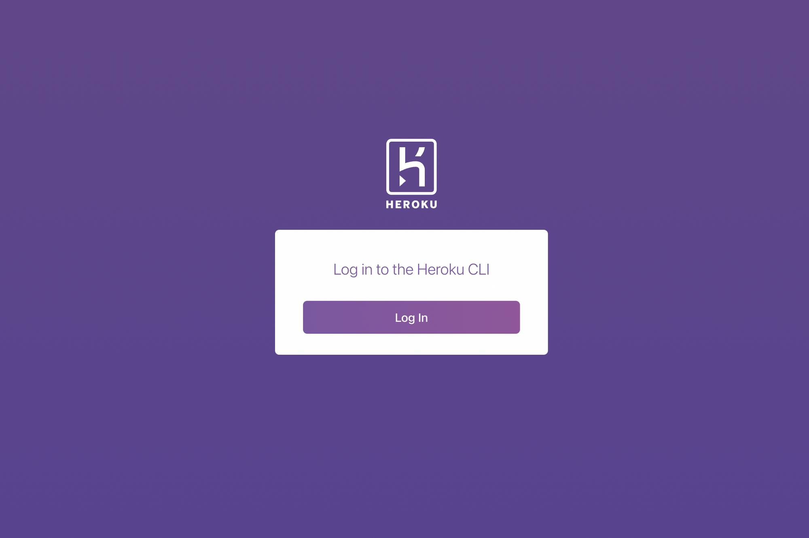

   - [브라우저] 로그인 완료 확인, 창 닫기

      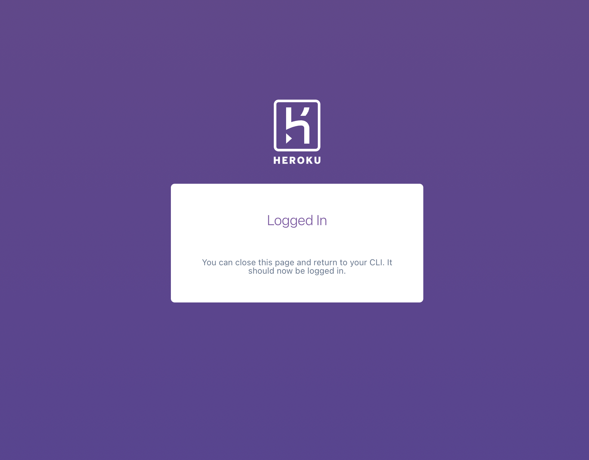

   - [터미널] 로그인 성공 메세지 확인

      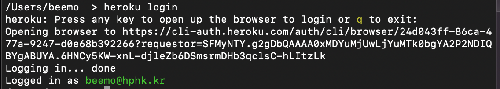

2. [터미널] Heroku 앱 생성

   ```bash
   # 앱 이름을 정해서 랜덤으로 정해서 생성해줍니다.
   heroku create
   ```

3. [터미널] 헤로쿠 환경(배포 환경)에서의 환경 변수(env) 등록

   - [브라우저] 헤로쿠 대쉬보드 접속
     - [heroku dashboard](https://dashboard.heroku.com/apps/)
   - [브라우저] 생성한 앱 대쉬보드 접속
   - [브라우저] Settings - Reveal Config Vars 클릭

      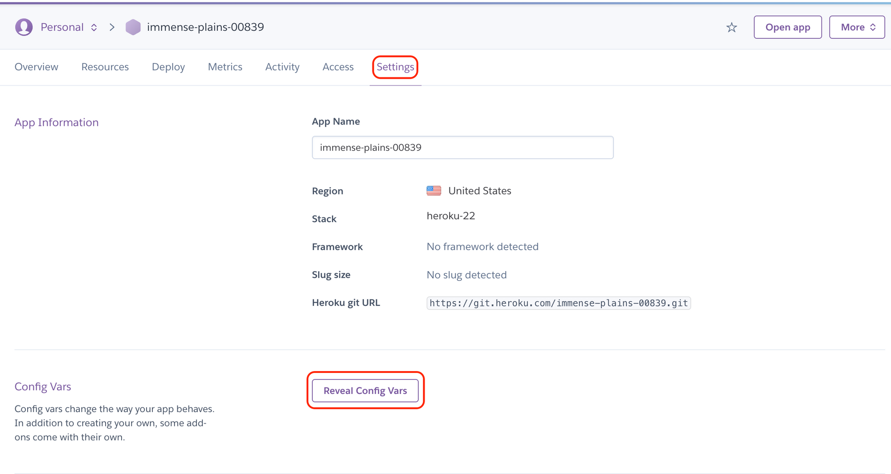

   - DEBUG = False 입력 → Add 클릭 / SECRET_KEY = 생성한 SECRET_KEY 입력 → Add 클릭

      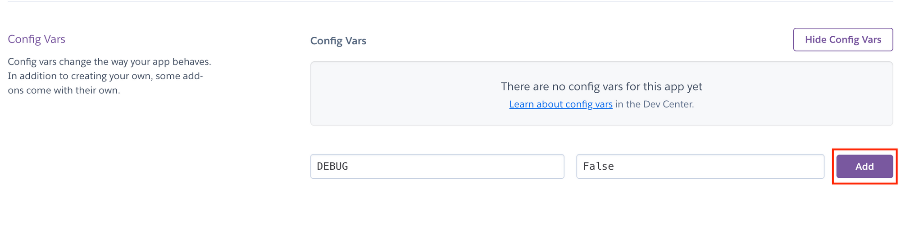

      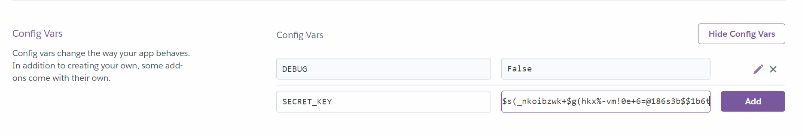

4. [터미널] 배포

   ```bash
   git add .

   git commit -m "Commit Message"

   # 로컬 master 브랜치 -> 헤로쿠 저장소 master 브랜치
   git push heroku master
   ```

5. [터미널] 데이터베이스 설정

   ```bash
   # 데이터베이스 마이그레이트
   heroku run python manage.py migrate

   # 관리자 계정 생성
   heroku run python manage.py createsuperuser
   ```

6. [터미널] 웹사이트 열기

   ```bash
   heroku open
   ```

> 재배포

- `git add - commit - push heroku master`를 합니다.

- makemigrations를 했다면 migrate를 합니다.

> 에러 해결

1. 업로드한 이미지(Media)가 보이지 않아요.

   - Heroku는 업로드한 파일을 저장을 해주지 않습니다.(무료 플랜)
   - 파일 업로드는 AWS의 S3를 사용해서 처리해야 합니다.

2. 에러 메세지(1) 

   - Your account has reached its concurrent builds limit.

      ```bash
      # 터미널에 아래 명령어를 입력해서 헤로쿠를 재시작합니다.
      heroku restart
      ```

3. 에러 메세지(2)

   - You're using the staticfiles app without having set the STATIC_ROOT setting to a filesystem path

   - `STATIC_ROOT`를 확인해주세요. 

4. 정적(static) 파일 출력이 안되요.

   - `whitenoise`를 확인해주세요.

5. 에러 메세지(3)

   - raise KeyError(key) from None
   - KeyError: '…'

   - 헤로쿠 환경 변수 `SECRET_KEY` 를 확인해주세요. 

6. 에러 화면

   - Bad Request (400)

   - `ALLOWED_HOSTS`를 확인해주세요.


## 요구 사항

> 모델 Model - `M`

1. 모델 이름 : User
  
  - Django `AbstractUser` 모델을 상속 받고, 필드를 직접 정의하세요.

2. 모델 이름 : Review

   - 모델의 필드를 직접 정의하세요.

3. 모델 이름 : Comment

   - 모델의 필드를 직접 정의하세요.

> 폼 Form

**회원 가입**

- Django 내장 회원 가입 폼 UserCreationForm을 상속 받아서 CustomUserCreationForm 생성
- 출력할 필드를 직접 정의합니다.

**로그인**

- Django 내장 로그인 폼 AuthenticationForm 활용

> 기능 View - `V`

**리뷰 reviews**

1. 데이터 목록 조회

   - `GET` `http://127.0.0.1:8000/reviews/`

2. 데이터 정보 조회

   - `GET` `http://127.0.0.1:8000/reviews/<int:review_pk>/`

3. 데이터 생성

   - `POST` `http://127.0.0.1:8000/reviews/create/`
   - 로그인한 유저만 데이터 생성이 가능합니다. 

4. 데이터 수정

   - `POST` `http://127.0.0.1:8000/reviews/<int:review_pk>/update/`
   - 해당 리뷰 작성자만 수정할 수 있습니다.

5. 데이터 삭제

   - `POST` `http://127.0.0.1:8000/reviews/<int:review_pk>/delete/`
   - 해당 리뷰 작성자만 삭제할 수 있습니다.

6. 리뷰 좋아요 / 좋아요 취소

   - `POST` `http://127.0.0.1:8000/reviews/<int:review_pk>/like/`
   - 로그인한 유저만 좋아요 기능을 사용할 수 있습니다.

**댓글 comments**

1. 리뷰의 댓글 목록 조회

   - `GET` `http://127.0.0.1:8000/reviews/<int:review_pk>/`
   - 해당 게시글의 댓글 목록 조회

2. 댓글 생성

   - `POST` `http://127.0.0.1:8000/reviews/<int:review_pk>/comments/create/`
   - 로그인한 유저만 댓글 생성이 가능합니다.

3. 댓글 삭제

   - `POST` `http://127.0.0.1:8000/reviews/<int:review_pk>/comments/<int:comment_pk>/delete/`
   - 해당 댓글 작성자만 삭제할 수 있습니다.

**회원 관리 accounts**

1. 회원 가입

   - `POST` `http://127.0.0.1:8000/accounts/signup/`

2. 회원 목록 조회

   - `GET` `http://127.0.0.1:8000/accounts/`

3. 회원 정보 조회

   - `GET` `http://127.0.0.1:8000/accounts/<int:user_pk>/`

4. 로그인

   - `POST` `http://127.0.0.1:8000/accounts/login/`

5. 로그아웃

   - `POST` `http://127.0.0.1:8000/accounts/logout/`

6. 팔로우

   - `POST` `http://127.0.0.1:8000/accounts/<int:user_pk>/follow/`
   - 로그인한 유저만 팔로우 기능을 사용할 수 있습니다.
   - 자기 자신은 팔로우 할 수 없습니다.

### 화면 Template

1. 네비게이션바, Bootstrap <nav>

   - 서비스 로고
   - 리뷰 목록 페이지 이동 버튼
   - 리뷰 작성 페이지 이동 버튼
   - 로그인 상태에 따라 다른 화면을 출력합니다.
     1. 로그인 상태
        - 로그인한 사용자의 username
        - 로그아웃 버튼
     2. 비 로그인 상태
        - 로그인 페이지 이동 버튼
        - 회원 가입 페이지 이동 버튼

2. 메인 페이지

   - `GET` `http://127.0.0.1:8000/`
   - 자유 디자인

3. 목록 페이지

   - `GET` `http://127.0.0.1:8000/reviews/`

4. 리뷰 정보 페이지

   - `GET` `http://127.0.0.1:8000/reviews/<int:review_pk>/`
   - 해당 리뷰 정보 출력
   - 댓글 작성 폼
   - 해당 리뷰에 작성된 댓글 목록
     - 각 댓글에는 삭제 버튼이 있습니다. 단, 댓글 작성자만 삭제를 할 수 있습니다.
   - 좋아요 버튼
     - 해당 리뷰의 좋아요 개수를 함께 출력합니다.
     - 로그인한 유저는 리뷰에 좋아요를 남길 수 있습니다.

5. 리뷰 작성 페이지

   - `GET` `http://127.0.0.1:8000/reviews/create/` 
   - 리뷰 작성 폼

6. 리뷰 수정 페이지

   - `GET` `http://127.0.0.1:8000/reviews/<int:review_pk>/update/`
   - 리뷰 수정 폼

7. 회원 가입 페이지

   - `GET` `http://127.0.0.1:8000/accounts/signup/`
   - 회원 가입 폼

8. 회원 조회 페이지(프로필 페이지)

   - `GET` `http://127.0.0.1:8000/accounts/<int:user_pk>/`
   - 회원이 작성한 게시글 목록 출력

9. 로그인 페이지

   - `GET` `http://127.0.0.1:8000/accounts/login/`
   - 로그인 폼
   - 회원 가입 페이지 이동 버튼

10. 팔로우 버튼

   - 로그인한 유저는 해당 유저를 팔로우 할 수 있습니다.
   - 단, 자기 자신은 팔로우 할 수 없습니다.


## 프로젝트 결과 완성본


- 배포사이트: <https://halloweenk2y.herokuapp.com/>